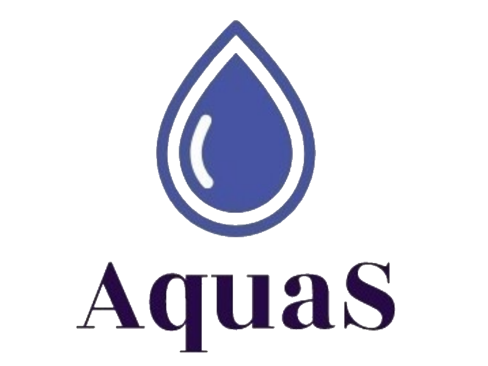

## The Platform For Groundwater Pollution Risk Analysis.
### Developers: SDido, LLnaki and SSlonim.

#### Abstract
Transportation is a vital part of our lives. 
Statistics say the average person drives 15,200Km each year.
We need energy, fuel to run our vehicles and we need good people
to make new kinds of fuel: greener, cheaper, and better.
Until then, we need to make sure our groundwater is not harmed by gasoline leakage.

The GroundWater Pollution Evaluator Application was developed upon a request from the Water Authority and under the supervision of The Robert H. Smith Faculty of Agriculture and The Computer Science Department of Bar-Ilan University.

#### The Goal
Our goal is to compile thousands of groundwater status reports with soil status reports in close vicinity to gas stations from many decades ago and build a hypothesis machine (Machine Learning model) to advice decision makers in the Water Authority with planning gas stations locations and setting pollution standards. 
According to numerous, easy to get, soil samples - predict the state of the groundwater beneath and around.

#### The Tools
Data – First we have accumulated almost 4k data samples of soil status reports and around 1k data samples of groundwater status reports.
Research Platform – We have an entire program, not uploaded, dedicated to our research.
User Platform – In order to communicate our findings with our clients we have developed a 
fully functional CRUD user-interface with dashboard presenting water-soil reports in a convenient way. 
Model Database – Last but not least we need to store our models and allow other researchers to upload and contribute to the mission. Of course, we also need to allow applying them on new problems. 

#### Technologies
Backend – Django and Django Rest Framework
Frontend – React, bootstrap, Tableau, google maps, chart.js
Database – PostgreSQL
Deployment – Docker

