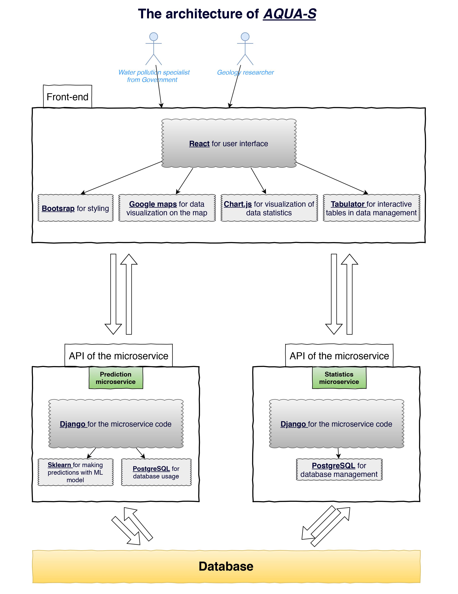

# The Platform For Groundwater Pollution Risk Analysis.
#### Developers: SDido, LLnaki and SSlonim.

### Abstract
Transportation is a vital part of our lives. 
Statistics say the average person drives 15,200Km each year.
We need energy, fuel to run our vehicles and we need good people
to make new kinds of fuel: greener, cheaper, and better.
Until then, we need to make sure our groundwater is not harmed by gasoline leakage.

The GroundWater Pollution Evaluator Application was developed upon a request from the Water Authority and under the supervision of The Robert H. Smith Faculty of Agriculture and The Computer Science Department of Bar-Ilan University.

### The Goal
Our goal is to compile thousands of groundwater status reports with soil status reports in close vicinity to gas stations from many decades ago and build a hypothesis machine (Machine Learning model) to advice decision makers in the Water Authority with planning gas stations locations and setting pollution standards. 
According to numerous, easy to get, soil samples - predict the state of the groundwater beneath and around.

### The Tools
Data – First we have accumulated almost 4k data samples of soil status reports and around 1k data samples of groundwater status reports.
Research Platform – We have an entire program, not uploaded, dedicated to our research.
User Platform – In order to communicate our findings with our clients we have developed a 
fully functional CRUD user-interface with dashboard presenting water-soil reports in a convenient way. 
Model Database – Last but not least we need to store our models and allow other researchers to upload and contribute to the mission. Of course, we also need to allow applying them on new problems. 

### Technologies
Backend – Django and Django Rest Framework 
Frontend – React, bootstrap, Tableau, google maps, chart.js 
Database – PostgreSQL 
Deployment – Docker

## Application Flow

### Language
As requested by our client the platform is in Hebrew.

### Registration system
We have created our user registration system based on delegation endeavor. 
We have a superuser that is the project head who is the only one who can register
other users.  Besides the superuser there are four user types: Guest, ML Developer, 
Researcher and Water Authority user.

### Statistics and Station Mapping
With the help of google maps we layout each sample location for a geographical insight and 
visual convenience. In addition we have implemented graphs and more information regarding 
the point of interest from the map by clicking on it.

Scrolling down we have broad statistics regarding combined effect of each sample in function of time. If interested in the status of the soil PID and TPH are the measurements for pollution.
If interested in the status of the groundwater then Xylene, MTBE, Toluene, Benzene and Ethylbenzene are the pollutants which we try to eliminate as much as we can from our groundwater. 

### Database 
There are a two ways to add new samples to our system. 
First make sure you are logged in as a Researcher or Water Authority.

I. Upload an excel file – This way is the fastest, but the uploader must know the 
correct format and make sure that there are no mistakes such as writing names in places of numbers. The full extent of these rules must be given to all users by the superuser. 
II. Type – This is the simplest way and although errors should be avoided they will be detected
sooner then in the first method.
Please mind the separation between soil samples table and water samples table. 

The data is saved in a PostgreSQL dedicated database.
If desired it can be viewed fully. Additionally, an authorized user can also edit or remove 
existing samples from the view of the database.
The data is blurred intentionally.

### Development 
This section is open only to machine learning models developers.
Each group of developers can make a model, save it as a pickle object (python object)
and upload the model to our system.
Before the model can be used it goes through a series of examinations, against real life data, our database. Only if the model passes a certain threshold will it be added to the collection of
models that we will see in the next section.

### Prediction
This section is open to every user including the Guest.
Here you need to select a group or developer and then select
a model appropriate to the pollutant in question.
For example: predict if Xylene particles will penetrate a groundwater cache, with a model named Xylene.

After selecting desired model, you can continue to fill in the soil measurements and requested time of prediction. 
Here is an example:

Note: This section is created dynamically according to model expectations of features.
Here SDido’s model of mtbe is looking for the following features:
Pid and Tph measurement, odor measurement and <a href="https://www.sciencedirect.com/topics/earth-and-planetary-sciences/hydraulic-conductivity">hydraulic conductivity</a> of the soil.
In addition it looks for the soil type. 

Time to prediction is more of a user preference than a feature due to the nature of how pollutant enters groundwater – it takes time. Also, pollution may evaporate and cleanse “by itself” from the groundwater, with time. Thus, the model needs to know the time frame between the soil sampling and the desired artificial or hypothetical groundwater sampling. 

## Conclusion

With the system’s ability to store analyze and test new groundwater pollution evaluator models against real data that our system can house and manage, we hope to create a world where drillings in order to check the status of groundwater would shrink to minimum thus saving money, time and nature.  
